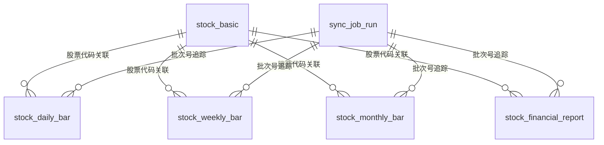

# 数据模型：数据源重构

**功能**: 005-数据源重构 | **日期**: 2026-03-21

## 1. 本次表结构调整总览

### 1.1 保留的表

| 表名 | 说明 | 本次处理 |
|------|------|----------|
| `stock_basic` | 股票基础主数据 | 保留并继续同步 |
| `stock_financial_report` | 财报历史数据 | 保留并扩展字段来源 |
| `sync_job_run` | 同步任务运行日志 | 保留 SQL 设计并补 ORM / API |

### 1.2 删除或废弃的表

| 表名 | 原用途 | 处理方式 |
|------|--------|----------|
| `stock_daily_quote` | 历史日行情 | 删除，改由 `stock_daily_bar` 替代 |
| `stock_valuation_daily` | 日级估值 | 删除，字段并入 `stock_daily_bar` |
| 依赖旧 `stock_daily_quote` 结构的历史旧数据 | 旧口径派生结果 | 不保留，必要时重新计算或重拉 |

### 1.3 新增的表

| 表名 | 说明 | 唯一粒度 |
|------|------|----------|
| `stock_daily_bar` | 历史日线主表，包含日行情 + 日估值 + 股息率等字段 | `stock_code + trade_date` |
| `stock_weekly_bar` | 历史周线表 | `stock_code + trade_week_end` |
| `stock_monthly_bar` | 历史月线表 | `stock_code + trade_month_end` |
| `sync_task` | 同步子任务状态（任务驱动） | `trade_date + task_type + trigger_type` |

## 2. 实体定义

### 2.1 股票基础信息 `stock_basic`

本表继续作为其它股票表的主数据来源。

| 字段 | 类型 | 约束 | 说明 |
|------|------|------|------|
| `id` | BIGINT | PK | 主键 |
| `code` | VARCHAR(20) | UK, NOT NULL | 股票代码，如 `000001.SZ` |
| `name` | VARCHAR(100) | NOT NULL | 股票名称 |
| `market` | VARCHAR(20) | NULL | 市场/交易所 |
| `industry_name` | VARCHAR(100) | NULL | 行业名称 |
| `region` | VARCHAR(50) | NULL | 地域 |
| `list_date` | DATE | NULL | 上市日期 |
| `data_source` | VARCHAR(32) | NOT NULL | 固定写 `tushare` |
| `sync_batch_id` | VARCHAR(64) | NULL | 同步批次号 |
| `synced_at` | DATETIME | NOT NULL | 最近同步时间 |
| `created_at` | DATETIME | NOT NULL | 创建时间 |
| `updated_at` | DATETIME | NOT NULL | 更新时间 |

**校验规则**
- `code` 必须唯一且非空。
- `data_source` 统一规范为 `tushare`。

### 2.2 股票历史日线 `stock_daily_bar`

本表是新的**日级主表**，用于承载收盘后历史日线和当日估值字段。

| 字段 | 类型 | 约束 | 说明 |
|------|------|------|------|
| `id` | BIGINT | PK | 主键 |
| `stock_code` | VARCHAR(20) | NOT NULL | 股票代码 |
| `trade_date` | DATE | NOT NULL | 交易日 |
| `open` | DECIMAL(12,4) | NULL | 开盘价 |
| `high` | DECIMAL(12,4) | NULL | 最高价 |
| `low` | DECIMAL(12,4) | NULL | 最低价 |
| `close` | DECIMAL(12,4) | NULL | 收盘价 |
| `prev_close` | DECIMAL(12,4) | NULL | 前收盘价 |
| `change_amount` | DECIMAL(12,4) | NULL | 涨跌额 |
| `pct_change` | DECIMAL(10,4) | NULL | 涨跌幅（%） |
| `volume` | DECIMAL(20,2) | NULL | 成交量 |
| `amount` | DECIMAL(20,2) | NULL | 成交额 |
| `amplitude` | DECIMAL(10,4) | NULL | 振幅（%） |
| `turnover_rate` | DECIMAL(10,4) | NULL | 换手率（%） |
| `volume_ratio` | DECIMAL(10,4) | NULL | 量比 |
| `total_market_cap` | DECIMAL(20,2) | NULL | 总市值 |
| `float_market_cap` | DECIMAL(20,2) | NULL | 流通市值 |
| `pe` | DECIMAL(12,4) | NULL | 市盈率 |
| `pe_ttm` | DECIMAL(12,4) | NULL | 市盈率 TTM |
| `pb` | DECIMAL(12,4) | NULL | 市净率 |
| `ps` | DECIMAL(12,4) | NULL | 市销率 |
| `dv_ratio` | DECIMAL(10,4) | NULL | 股息率 |
| `dv_ttm` | DECIMAL(10,4) | NULL | 股息率 TTM |
| `data_source` | VARCHAR(32) | NOT NULL | 数据源 |
| `sync_batch_id` | VARCHAR(64) | NULL | 同步批次号 |
| `synced_at` | DATETIME | NOT NULL | 同步时间 |
| `created_at` | DATETIME | NOT NULL | 创建时间 |
| `updated_at` | DATETIME | NOT NULL | 更新时间 |

**约束**
- `UNIQUE(stock_code, trade_date)`

**索引建议**
- `(trade_date, stock_code)`
- `(trade_date, pct_change)`
- `(trade_date, pe)`
- `(trade_date, pb)`

**字段来源**
- 行情字段来自 `Tushare daily`
- 估值 / 股息率 / 市值 / 换手率来自 `Tushare daily_basic`

**校验规则**
- 同一股票同一交易日仅允许一条记录。
- 若 `daily` 存在但 `daily_basic` 缺失，可允许估值字段为空，但必须记录任务告警。
- 本表仅保存**收盘后历史日线**，不保存实时或盘中数据。

### 2.3 股票历史周线 `stock_weekly_bar`

| 字段 | 类型 | 约束 | 说明 |
|------|------|------|------|
| `id` | BIGINT | PK | 主键 |
| `stock_code` | VARCHAR(20) | NOT NULL | 股票代码 |
| `trade_week_end` | DATE | NOT NULL | 周线对应的结束交易日 |
| `open` | DECIMAL(12,4) | NULL | 周开盘价 |
| `high` | DECIMAL(12,4) | NULL | 周最高价 |
| `low` | DECIMAL(12,4) | NULL | 周最低价 |
| `close` | DECIMAL(12,4) | NULL | 周收盘价 |
| `change_amount` | DECIMAL(12,4) | NULL | 周涨跌额 |
| `pct_change` | DECIMAL(10,4) | NULL | 周涨跌幅（%） |
| `volume` | DECIMAL(20,2) | NULL | 周成交量 |
| `amount` | DECIMAL(20,2) | NULL | 周成交额 |
| `data_source` | VARCHAR(32) | NOT NULL | 数据源 |
| `sync_batch_id` | VARCHAR(64) | NULL | 同步批次号 |
| `synced_at` | DATETIME | NOT NULL | 同步时间 |
| `created_at` | DATETIME | NOT NULL | 创建时间 |
| `updated_at` | DATETIME | NOT NULL | 更新时间 |

**约束**
- `UNIQUE(stock_code, trade_week_end)`

**校验规则**
- 仅保存历史周线，不做盘中周线刷新。

### 2.4 股票历史月线 `stock_monthly_bar`

| 字段 | 类型 | 约束 | 说明 |
|------|------|------|------|
| `id` | BIGINT | PK | 主键 |
| `stock_code` | VARCHAR(20) | NOT NULL | 股票代码 |
| `trade_month_end` | DATE | NOT NULL | 月线对应的结束交易日 |
| `open` | DECIMAL(12,4) | NULL | 月开盘价 |
| `high` | DECIMAL(12,4) | NULL | 月最高价 |
| `low` | DECIMAL(12,4) | NULL | 月最低价 |
| `close` | DECIMAL(12,4) | NULL | 月收盘价 |
| `change_amount` | DECIMAL(12,4) | NULL | 月涨跌额 |
| `pct_change` | DECIMAL(10,4) | NULL | 月涨跌幅（%） |
| `volume` | DECIMAL(20,2) | NULL | 月成交量 |
| `amount` | DECIMAL(20,2) | NULL | 月成交额 |
| `data_source` | VARCHAR(32) | NOT NULL | 数据源 |
| `sync_batch_id` | VARCHAR(64) | NULL | 同步批次号 |
| `synced_at` | DATETIME | NOT NULL | 同步时间 |
| `created_at` | DATETIME | NOT NULL | 创建时间 |
| `updated_at` | DATETIME | NOT NULL | 更新时间 |

**约束**
- `UNIQUE(stock_code, trade_month_end)`

### 2.5 股票财报历史 `stock_financial_report`

本表保留，继续作为报告期维度的历史财报数据表。

| 字段 | 类型 | 约束 | 说明 |
|------|------|------|------|
| `id` | BIGINT | PK | 主键 |
| `stock_code` | VARCHAR(20) | NOT NULL | 股票代码 |
| `report_date` | DATE | NOT NULL | 报告期 |
| `report_type` | VARCHAR(16) | NULL | 报告类型 |
| `revenue` | DECIMAL(20,2) | NULL | 营收 |
| `net_profit` | DECIMAL(20,2) | NULL | 净利润 |
| `eps` | DECIMAL(12,4) | NULL | 每股收益 |
| `bps` | DECIMAL(12,4) | NULL | 每股净资产 |
| `roe` | DECIMAL(10,4) | NULL | ROE |
| `gross_margin` | DECIMAL(10,4) | NULL | 毛利率 |
| `net_margin` | DECIMAL(10,4) | NULL | 净利率 |
| `data_source` | VARCHAR(32) | NOT NULL | 数据源 |
| `sync_batch_id` | VARCHAR(64) | NULL | 同步批次号 |
| `synced_at` | DATETIME | NOT NULL | 同步时间 |
| `created_at` | DATETIME | NOT NULL | 创建时间 |
| `updated_at` | DATETIME | NOT NULL | 更新时间 |

**约束**
- `UNIQUE(stock_code, report_date)`

### 2.6 同步任务运行日志 `sync_job_run`

本表用于页面化监控和任务追踪。

| 字段 | 类型 | 约束 | 说明 |
|------|------|------|------|
| `id` | BIGINT | PK | 主键 |
| `job_name` | VARCHAR(64) | NOT NULL | 任务名，如 `stock_sync_daily` |
| `job_mode` | VARCHAR(16) | NOT NULL | `incremental` / `backfill` |
| `trade_date` | DATE | NULL | **交易日**（已解析的开市日） |
| `batch_id` | VARCHAR(64) | UK, NOT NULL | 批次号 |
| `status` | VARCHAR(16) | NOT NULL | `running` / `success` / `partial_failed` / `failed` / `skipped` |
| `started_at` | DATETIME | NOT NULL | 开始时间 |
| `finished_at` | DATETIME | NULL | 结束时间 |
| `stock_total` | INT | NULL | 预计处理股票数 |
| `basic_rows` | INT | DEFAULT 0 | 基础信息写入数 |
| `daily_rows` | INT | DEFAULT 0 | 日线写入数 |
| `weekly_rows` | INT | DEFAULT 0 | 周线写入数 |
| `monthly_rows` | INT | DEFAULT 0 | 月线写入数 |
| `report_rows` | INT | DEFAULT 0 | 财报写入数 |
| `failed_stock_count` | INT | DEFAULT 0 | 单标失败数 |
| `error_message` | VARCHAR(1000) | NULL | 错误摘要 |
| `extra_json` | JSON | NULL | 模块级详情、失败明细 |

**状态流转**

```text
running -> success
running -> partial_failed
running -> failed
running -> skipped
```

**状态说明**
- `running`：任务启动，尚未结束
- `success`：所有模块成功
- `partial_failed`：主任务完成，但存在子模块失败或单标失败
- `failed`：整批任务失败
- `skipped`：非交易日或不满足执行条件而跳过

### 2.7 同步子任务状态表 `sync_task`（与 `sync_job_run` 配合）

> **说明**：本表为**状态驱动**的子任务表，**不替代** `sync_job_run`。定时任务在交易日为 `auto` 维度写入四条子任务并顺序执行 pending；`sync_job_run` 记录单次执行的行数汇总（`job_name=stock_sync_auto` 时 `extra_json.task_driven=true`）。

| 字段 | 类型 | 约束 | 说明 |
|------|------|------|------|
| `id` | BIGINT | PK | 主键 |
| `trade_date` | DATE | NOT NULL | **交易日** |
| `task_type` | VARCHAR(32) | NOT NULL | `basic` / `daily` / `weekly` / `monthly` |
| `trigger_type` | VARCHAR(16) | NOT NULL | `auto` / `manual`（当前定时仅 `auto`） |
| `status` | VARCHAR(32) | NOT NULL | `pending` / `running` / `success` / `failed` / … |
| `batch_id` | VARCHAR(64) | NULL | 本次执行关联的 `sync_job_run.batch_id` |
| `rows_affected` | INT | NOT NULL | 本子任务写入行数 |
| `error_message` | TEXT | NULL | 失败原因（不重试） |
| `started_at` | DATETIME | NULL | 开始时间 |
| `finished_at` | DATETIME | NULL | 结束时间 |
| `created_at` | DATETIME | NOT NULL | 创建时间 |
| `updated_at` | DATETIME | NOT NULL | 更新时间 |

**唯一约束**：`UNIQUE(trade_date, task_type, trigger_type)`，保证自动任务同日同类型不重复插入。

## 3. 实体关系



说明：
- 业务层通过 `stock_code` 做逻辑关联，当前不强制数据库外键。
- `sync_batch_id` 用于明细表反查所属批次。

## 4. 同步写入规则

### 4.1 增量同步

- `stock_basic`：按 `code` upsert
- `stock_daily_bar`：按 `(stock_code, trade_date)` upsert
- `stock_weekly_bar`：按 `(stock_code, trade_week_end)` upsert
- `stock_monthly_bar`：按 `(stock_code, trade_month_end)` upsert
- `stock_financial_report`：按 `(stock_code, report_date)` upsert

### 4.2 历史回灌

- 支持按日期区间或模块维度执行
- 回灌与增量共用同一套写入规则
- 不保留旧表旧数据；若需重新对齐，直接重新回灌

## 5. 查询口径

- **选股页主数据源**：`stock_daily_bar`
- **选股页补充维度**：`stock_basic`、`stock_financial_report`
- **周/月线消费端**：后续页面或技术分析模块直接查询 `stock_weekly_bar`、`stock_monthly_bar`
- **任务监控页**：以 `sync_job_run` 为主；若落地状态表，可增加子任务维度展示（见 §2.7）

## 6. 待后续扩展但本期不强制落地

- `sync_task` 的 **manual** 触发写入与前端筛选深化
- 周 / 月技术指标表
- 财务三大报表分表
- 实时行情、分时数据、盘中刷新
