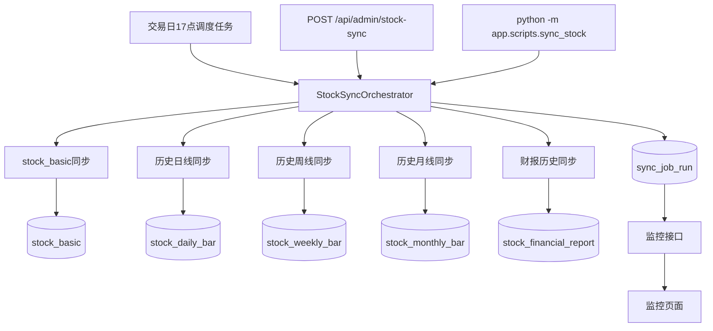

# 实现计划：数据源重构

**分支**: `005-数据源重构` | **日期**: 2026-03-21 | **规格**: [spec.md](./spec.md)  
**输入**: 功能规格来自 `specs/005-数据源重构/spec.md`，并补充约束：**日线不需要“快照”概念，日线就是历史日线数据，最新数据最多到当日收盘价。**

**说明**: 本计划面向可直接实现的粒度，后续若你继续细化 Tushare 接口口径，可在此基础上增量修订，不推翻主结构。

## 概要

- **目标**：将项目股票数据源从智兔彻底切换为 **Tushare**，删除旧数据与不合理旧表，重建“**历史日线 + 周线 + 月线 + 财报历史 + 任务监控**”的数据体系。
- **核心路线**：废弃旧 `stock_daily_quote` / `stock_valuation_daily` 拆分方案，改为一张新的**历史日线主表**承载收盘后行情与当日估值字段；新增**周线表**、**月线表**；保留并扩展**财报历史表**；新增**任务运行日志表**支撑监控页面。
- **同步策略**：所有日常增量任务统一在**每个交易日 17:00** 触发，仅处理收盘后数据；不接入实时盘口、分时或盘中刷新。
- **迁移原则**：旧数据、旧表和兼容层全部删除；新结构落地后通过**全量历史回灌 + 日常增量同步**恢复数据。

## 技术背景

- **语言/版本**: Python 3.12、TypeScript、Vue 3
- **主要依赖**: FastAPI、SQLAlchemy、MySQL、APScheduler、Pydantic、Tushare SDK
- **存储**: MySQL
- **测试**: pytest、后端接口手工验证、前端页面联调
- **目标平台**: Linux 服务器、现代浏览器
- **项目类型**: Web 应用（前后端）
- **性能目标**: 选股首屏接口维持现有可用水平；单次日常增量同步在当天任务窗口内完成
- **约束**: Tushare 存在接口积分与频率限制；财报接口不适合一次性全市场拉取；17:00 后需先判断是否为交易日
- **规模/范围**: A 股全市场数千只标的；需覆盖历史日线、历史周线、历史月线与财报历史

## 章程检查

*门禁：Phase 0 调研前须通过；Phase 1 设计后复检。*

- `.specify/memory/constitution.md` 当前仍是占位模板，**未核定，无强制门禁**。
- 已知项目级规则已满足：
  - 文档与计划正文使用中文；
  - 本功能按 `specs/005-数据源重构/` 持续维护；
  - 默认在 `main` 上开发，不新建功能分支。

## 关键设计详述

### 数据流与接口职责

#### 1. 总体数据流



#### 2. Tushare 接口分工

- **股票基础信息**：`stock_basic`
- **历史日线**：`daily`
- **日级估值/股息率**：`daily_basic`
- **历史周线**：`weekly`
- **历史月线**：`monthly`
- **财报历史**：初版以 `income` 为主，后续按你要求扩展 `balancesheet`、`cashflow`、`fina_indicator`
- **交易日判断**：`trade_cal`

#### 3. 后端服务拆分

建议把当前 [backend/app/services/stock_sync_service.py](../../backend/app/services/stock_sync_service.py) 的单函数模式，拆为“编排层 + 子任务服务”：

1. `backend/app/services/stock_sync_orchestrator.py`
   - 生成 `batch_id`
   - 判断同步模式：`incremental` / `backfill`
   - 调用各子任务
   - 写 `sync_job_run`
2. `backend/app/services/stock_basic_sync_service.py`
   - 复用现有基础信息同步能力
3. `backend/app/services/stock_daily_bar_sync_service.py`
   - 拉取 `daily` 与 `daily_basic`
   - 按 `(ts_code, trade_date)` 合并
   - 写入新的 `stock_daily_bar`
4. `backend/app/services/stock_weekly_bar_sync_service.py`
   - 拉取 `weekly`
   - 写入 `stock_weekly_bar`
5. `backend/app/services/stock_monthly_bar_sync_service.py`
   - 拉取 `monthly`
   - 写入 `stock_monthly_bar`
6. `backend/app/services/stock_financial_sync_service.py`
   - 拉取财报历史
   - 写入 `stock_financial_report`

#### 4. 查询接口职责

- **选股列表接口**
  - 路径：`GET /api/stock/screening`
  - 后端读取：`stock_daily_bar + stock_basic + 最新 stock_financial_report`
  - 主要新增筛选字段：`pe`、`pe_ttm`、`pb`、`dv_ratio`
  - 错误约定：
    - `401` 未登录
    - `422` 参数非法
    - `500` 服务异常
- **最新数据日期接口**
  - 路径：`GET /api/stock/screening/latest-date`
  - 读取 `stock_daily_bar` 的最大 `trade_date`
  - 仅说明最新历史日线日期，不表达实时性
- **手动触发同步接口**
  - 路径：`POST /api/admin/stock-sync`
  - 请求体建议：
    - `mode`: `incremental` / `backfill`
    - `modules`: 可选，如 `["daily","weekly","monthly","financial"]`
    - `start_date` / `end_date`: 回灌时使用
  - 鉴权：沿用 `X-Admin-Secret`
  - 返回：`202 Accepted` + `batch_id`
- **任务监控接口**
  - `GET /api/admin/sync-jobs`
  - `GET /api/admin/sync-jobs/{batch_id}`
  - 返回任务状态、条数、错误摘要、模块粒度结果

#### 5. 前后端职责划分

- **后端负责**
  - Tushare 拉数
  - 合并 `daily` 与 `daily_basic`
  - 历史日/周/月/财报落库
  - 任务监控落库与查询
  - 登录态校验与管理接口鉴权
- **前端负责**
  - 选股页新增 PE / PB / 股息率等列与筛选项
  - 展示最新历史日线日期
  - 新增任务监控页面，展示批次、状态、错误与写入条数
  - 不在前端做任何行情聚合或估值计算

### 定时任务与部署设计

- **使用的组件**: APScheduler，代码位置为 [backend/app/core/scheduler.py](../../backend/app/core/scheduler.py)
- **注册方式**: 在 [backend/app/main.py](../../backend/app/main.py) 的 FastAPI lifespan 中启动调度器
- **调度策略**:
  - CRON：每日 `17:00`，上海时区
  - 任务开始后先通过 `trade_cal` 判断是否为交易日
  - 若当天不是交易日，则记录一条 `skipped` 任务记录并退出
- **部署时是否执行一次**: 否
  - 原因：本功能需要清库重建与历史回灌，不能在应用启动时自动执行，避免误删或长时间阻塞
- **手动触发方式**:
  - [x] HTTP 接口：`POST /api/admin/stock-sync`，Header 使用 `X-Admin-Secret`
  - [x] 管理命令：`python -m app.scripts.sync_stock --mode incremental|backfill`
  - [ ] 脚本：如后续部署需要，再补 `backend/scripts/run_stock_sync.sh`
- **失败与重试**:
  - 单次 Tushare API 调用继续使用客户端内重试
  - `daily` / `daily_basic` / `weekly` / `monthly` 失败时记录模块失败并终止当前批次
  - `income` 等按标的接口允许单标失败继续，但要记录失败股票数
  - 整批任务不做无限自动重试，避免重复大规模写库
- **日志与可观测**:
  - 继续复用 [backend/app/core/scheduled_job_logging.py](../../backend/app/core/scheduled_job_logging.py)
  - 新增 `sync_job_run` ORM，并按批次记录：
    - `job_name`
    - `job_mode`
    - `batch_id`
    - `status`
    - `started_at`
    - `finished_at`
    - 各模块写入条数
    - 错误摘要
    - `extra_json`
  - 页面监控仅读 `sync_job_run`，不直接解析日志文件

### 其他关键设计

#### 1. 数据模型方向

- **删除/废弃**
  - `stock_daily_quote`
  - `stock_valuation_daily`
  - 任何依赖旧 `stock_daily_quote` 结构的派生旧数据
- **新增**
  - `stock_daily_bar`
  - `stock_weekly_bar`
  - `stock_monthly_bar`
  - `sync_job_run` ORM（若库中已有表则直接接入）
- **保留**
  - `stock_basic`
  - `stock_financial_report`

#### 2. 日线单表设计原则

- 日线表是**历史日线表**，不是快照表
- 一条记录代表“某股票某交易日收盘后的唯一历史日线”
- 通过 `daily + daily_basic` 合并得到
- 字段至少包括：
  - 价格：`open`、`high`、`low`、`close`、`prev_close`
  - 涨跌：`change_amount`、`pct_change`、`amplitude`
  - 成交：`volume`、`amount`
  - 估值：`pe`、`pe_ttm`、`pb`、`ps`
  - 分红：`dv_ratio`、`dv_ttm`
  - 其它：`turnover_rate`、`volume_ratio`、`total_market_cap`、`float_market_cap`

#### 3. 周/月线设计原则

- 使用 Tushare 的 `weekly`、`monthly` 直接落库
- 当前阶段只做基础行情与成交字段，不在本期直接落周/月 MACD
- 后续周/月技术指标若要支持，再新增技术分析表或计算服务

#### 4. 迁移策略

1. 更新 [docs/数据库设计.md](../../docs/数据库设计.md)
2. 编写新 SQL 脚本，如 `backend/scripts/reset_and_init_v3.sql`
3. 清空旧表与旧数据
4. 创建新表结构
5. 先同步 `stock_basic`
6. 再回灌历史日线、周线、月线
7. 最后回灌财报历史
8. 切换选股接口与前端页面到新模型

#### 5. 风险与边界

- `daily_basic` 与 `daily` 在个别交易日可能存在字段缺失或行数不一致，必须按 `(ts_code, trade_date)` 容错合并
- 财报历史回灌耗时最长，建议与行情历史回灌分开执行
- 选股页依赖的新筛选字段上线前，后端响应结构和前端列定义必须同步调整

## 项目结构

### 本功能文档

```text
specs/005-数据源重构/
├── plan.md
├── research.md
├── data-model.md
├── quickstart.md
├── contracts/
│   ├── stock-screening-api.md
│   └── sync-job-api.md
└── checklists/
    └── requirements.md
```

### 源码结构（仓库根目录）

```text
backend/
├── app/
│   ├── api/
│   │   ├── admin.py                  # 手动同步、任务监控接口
│   │   └── stock.py                  # 选股接口
│   ├── core/
│   │   ├── scheduler.py              # 17:00 调度
│   │   └── scheduled_job_logging.py  # 任务告警日志
│   ├── models/
│   │   ├── stock_basic.py
│   │   ├── stock_daily_bar.py        # 新增：历史日线主表
│   │   ├── stock_weekly_bar.py       # 新增：历史周线
│   │   ├── stock_monthly_bar.py      # 新增：历史月线
│   │   ├── stock_financial_report.py
│   │   └── sync_job_run.py           # 新增：任务运行日志
│   ├── services/
│   │   ├── tushare_client.py
│   │   ├── stock_sync_orchestrator.py
│   │   ├── stock_daily_bar_sync_service.py
│   │   ├── stock_weekly_bar_sync_service.py
│   │   ├── stock_monthly_bar_sync_service.py
│   │   ├── stock_financial_sync_service.py
│   │   └── screening_service.py
│   └── scripts/
│       └── sync_stock.py
└── scripts/
    └── reset_and_init_v3.sql

frontend/
├── src/
│   ├── views/
│   │   ├── StockScreeningView.vue
│   │   └── SyncJobMonitorView.vue
│   ├── api/
│   │   └── stock.ts
│   └── router/
│       └── index.ts
```

**结构说明**: 本功能以后端为主，先完成数据库重建与同步链路重构，再修改选股页与监控页；周/月线当前只要求数据与表结构准备就绪，不强制本期全部消费端一起上线。

## 复杂度与例外

| 违反项 | 为何需要 | 为何不采用更简单方案 |
|--------|----------|----------------------|
| 用新 `stock_daily_bar` 替代旧 `stock_daily_quote` 与 `stock_valuation_daily` | 旧设计把日行情与估值拆散，无法满足当前收盘后决策字段需求 | 保留双表会继续造成查询、筛选与维护口径分裂 |
| 引入编排层 + 多子任务服务 | 日线、周线、月线、财报来自不同 Tushare 接口，失败模式不同 | 继续沿用单个 `run_sync()` 会让扩展与监控不可维护 |
