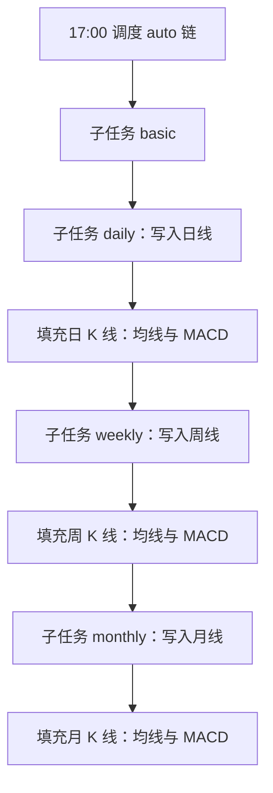

# 实现计划：技术指标扩展（均线与 MACD 落库）

**分支**: `006-技术指标扩展` | **日期**: 2026-03-22 | **规格**: [spec.md](./spec.md)

**输入**: 功能规格来自 `specs/006-技术指标扩展/spec.md`。本期**仅**实现日/周/月 K 线表上的**均线与 MACD 计算与持久化**；**选股、筛选、对外 API** 不在本期（见规格「本期不包含」）。

**说明**: 本计划面向可直接实现的粒度；实现时与 [data-model.md](./data-model.md)、[contracts/](./contracts/) 保持一致。

## 概要

- **目标**：在 `stock_daily_bar`、`stock_weekly_bar`、`stock_monthly_bar` 上扩展字段，按统一口径写入 **SMA（简单移动平均）** 与 **MACD（12/26/9）**，支持**增量更新**与**历史回填**，任务失败可追踪。
- **核心路线**：
  1. 数据库迁移：三张 bar 表增加指标列（见 `data-model.md`）。
  2. 纯函数层：SMA、EMA（用于 MACD）、MACD 序列计算（建议 `pandas` 或自实现滚动，与验收抽样对齐）。
  3. 填充服务：按 `stock_code` 分标的拉取有序 K 线，计算后 **UPDATE** 对应行（批量提交、控制内存）。
  4. **触发方式（与行情顺序强绑定）**：
     - **定时 auto 链**：在现有 **日线 → 周线 → 月线** 各子任务**成功写入该周期 K 线之后**，**立刻**对该周期执行均线与 MACD 填充（「先有 K 线，再算该周期指标」）。不在周线/月线尚未同步时去算周/月指标。
     - **注意**：计算某一日的 `ma60` / `MACD` 除「当日已有 bar」外，还需向前取足够历史 K 线（见下文「增量策略」）；**不是只读一行**。
     - **手动补算**：提供 **HTTP**（`POST /api/admin/stock-indicators`）与 **CLI**，用于**一次性补全缺失指标**、历史区间回填或故障后修复（全表或按时间范围/标的限制）。
- **不复权混合**：指标仅基于表中已有 `close`（与当前同步策略一致；若全表均为前复权口径，则指标亦为前复权口径——见 `research.md`）。

## 技术背景

- **语言/版本**: Python 3.12
- **主要依赖**: FastAPI、SQLAlchemy 2.x、MySQL、APScheduler、pandas（用于向量计算与验收对齐，版本与 `backend` 依赖统一）
- **存储**: MySQL 8.x
- **测试**: pytest；指标与参考序列对比（固定样本 CSV 或少量代码内数组）
- **目标平台**: Linux 服务器（与现网一致）
- **项目类型**: Web 后端 + 定时任务（**本期无前端页面**，除非管理端已有统一入口可挂接）
- **性能目标**: 全市场增量在**收盘后任务窗口内**完成（与日线+周月线同步同一日晚间；若超时则分批/异步后续迭代，本期须在日志中可观测耗时与行数）
- **约束**: 全市场约 5000+ 标的 × 多周期 × 长历史，须**按标的或按批次**流式处理，避免一次性加载全表到内存
- **规模/范围**: A 股全市场（与 `stock_basic` 一致）；三周期 bar 均已存在的前提下加工

## 章程检查

- `.specify/memory/constitution.md` 未核定，**无强制门禁**。
- 项目级规则：正文中文；规格目录 `specs/006-技术指标扩展/` 持续维护；默认在 `main` 开发。

## 关键设计详述

### 数据流与接口职责



1. **输入**：各表已有 `close`（及日期列：`trade_date` / `trade_week_end` / `trade_month_end`），按标的、按时间升序。
2. **计算**：
   - **均线**：对 `close` 的 **SMA**，周期 **5、10、20、60**（列名见 `data-model.md`）。
   - **MACD**：`EMA12(close) - EMA26(close)` 为 DIF；`EMA9(DIF)` 为 DEA；**柱** `hist = 2 * (DIF - DEA)`（与常见软件一致）。
3. **输出**：同表 **UPDATE** 指标列；历史不足处 **NULL**（不使用 0 冒充）。
4. **对外接口（本期）**：
   - **管理端**（与现有 `POST /api/admin/stock-sync` 同级鉴权）：触发指标回填/增量，见 [contracts/admin-stock-indicators-api.md](./contracts/admin-stock-indicators-api.md)。
   - **无**用户侧选股接口（下期规格）。

### 定时任务与部署设计

- **使用的组件**: `APScheduler`（`backend/app/core/scheduler.py`）；子任务执行器（`backend/app/services/sync_task_runner.py`）；各周期同步服务末尾或 runner 内**串联**指标填充。
- **注册方式**: 保持现有每日 **17:00** 触发 `ensure_auto_tasks_for_trade_date` + `execute_pending_auto_sync`；**不新增**第四类 `sync_task` 类型 `indicators`（避免与「紧跟各周期 K 线」语义割裂）。在 **`daily` / `weekly` / `monthly` 子任务内部**：该模块把行情写入 DB **成功后**，**同步调用**「该周期」的 `stock_indicator_fill_service`（实现位置二选一：**`sync_task_runner._run_module_by_type` 在对应分支末尾调用**，或各 `*_sync_service` 末尾调用；以代码复用清晰为准）。
- **调度策略**: 子任务顺序仍为 **basic → daily → weekly → monthly**；每个非 basic 子任务在**本模块行情提交成功后**再算指标。若某一子任务失败（例如周线未写入），则**仅该周期指标跳过**，其它已成功周期不受影响。
- **部署时是否执行一次**: **否**（与现网一致依赖定时）；首次上线或历史缺指标需运维执行 **CLI 或 admin 全量/区间补算**。
- **手动触发方式**（本期两种都提供，用于补全缺失、回填历史）：
  - [x] HTTP：`POST /api/admin/stock-indicators`（见契约），支持按 `timeframes`、日期区间、`limit` **一次性补全**或重算。
  - [x] 管理命令：`python -m app.scripts.fill_stock_indicators`（参数：`--mode incremental|backfill|full`、`--timeframe`、`--start-date` / `--end-date`（仅 backfill）等，以实现为准）
  - **说明**：`python -m app.scripts.sync_stock` 与 `run_stock_sync` 在未指定 `modules` 时，默认与定时任务一致为 **basic + daily + weekly + monthly**，各周期行情成功后同编排内填充该周期指标；与此前「默认仅 basic+daily」的旧行为不同。
- **失败与重试**: 行情子任务失败按现有逻辑写 `sync_task`；**指标填充失败**建议记日志并可在 `sync_job_run.extra_json` 或单独字段中体现（实现时二选一），便于区分「行情成功、指标失败」；**不自动无限重试**。
- **日志与可观测**: 行情 + 指标各记 batch_id、标的数、更新行数、耗时；异常打 stack + 截断写入 DB。

### 增量与回填策略

- **增量（日常）**：对全市场每个 `stock_code`，读取该周期**最近 `window` 根** K 线（`window` ≥ max(60, MACD 稳定所需长度)，建议 **120 根**日线等价或按周期调整），重算窗口内指标并写回窗口内各（或仅最新一根——为与 SMA/MACD 全局一致，建议**写回窗口内全部行**，避免前序日因新数据导致历史行变化未落库；若性能不足可二期优化为「仅更新末 N 行」并文档说明近似风险）。
- **回填（首次/补历史）**：按 `start_date`–`end_date` 分标的循环（区间内各行写回；区间外历史行不更新）；可支持 `--limit` 用于演练。
- **全量（`full`）**：每只股票加载该周期表内**全部**有序 K 线，整段计算后写回**每一行**（与增量只处理最近约 400 根、与 backfill 只处理日期区间内行区分）。

### 其他关键设计

- **周/月锚点**：周线 `trade_week_end`、月线 `trade_month_end` 已为周期结束日，指标仅在该序列上计算，**不与日线混序列**。
- **NULL**：`close` 为 NULL 的行跳过或整段不写入指标（与 `data-model` 一致）。
- **并发**：本期采用**单进程内顺序**执行子任务即可；多进程并行分片可作为后续优化。

## 项目结构

### 本功能文档

```text
specs/006-技术指标扩展/
├── plan.md              # 本文件
├── research.md          # 口径与依赖调研结论
├── data-model.md        # 表字段与计算定义
├── quickstart.md        # 本地验证步骤
├── contracts/
│   └── admin-stock-indicators-api.md
└── tasks.md             # 由 /speckit.tasks 生成（可选）
```

### 源码结构（拟新增/修改）

```text
backend/
├── app/
│   ├── models/
│   │   ├── stock_daily_bar.py      # 扩展列
│   │   ├── stock_weekly_bar.py
│   │   └── stock_monthly_bar.py
│   ├── services/
│   │   ├── technical_indicator.py   # SMA/EMA/MACD 纯函数
│   │   └── stock_indicator_fill_service.py  # 按表/按标的填充
│   ├── services/sync_task_runner.py # _run_module_by_type：各周期 sync 成功后调用 fill
│   ├── api/admin.py                 # 新增 admin 路由（若与 stock-sync 并列）
│   └── scripts/
│       └── fill_stock_indicators.py
├── scripts/                         # 可选：根目录 SQL 迁移片段
└── tests/
    └── test_technical_indicator.py
```

**结构说明**: 计算与 IO 分离，便于单元测试对 pandas/纯函数验算；填充服务只依赖 ORM 与批量 UPDATE。

## 实现阶段建议

| 阶段 | 内容 |
|------|------|
| P0 | 迁移 + Model + `technical_indicator` 单元测试 |
| P1 | `stock_indicator_fill_service` + CLI 回填小样本 |
| P2 | `sync_task_runner` / 各 sync 服务：**daily/weekly/monthly 成功后即填充对应周期指标** + 日志 |
| P3 | Admin API + 文档 `docs/数据库设计.md` / `docs/定时任务说明.md` 同步 |

## 复杂度与例外

> 无章程违反；本期不引入消息队列，单任务链满足规格即可。

| 风险 | 缓解 |
|------|------|
| 全市场回填耗时长 | 分批、日志进度、支持 `--limit`；监控 `sync_task` 状态 |
| 浮点误差 | 验收约定误差阈值；DB 使用 `Decimal` 与统一 `round` 策略（见 `data-model.md`） |

## 文档同步（实现 PR 时）

- 更新 `docs/数据库设计.md`：三张 bar 表新增字段说明。
- 更新 `docs/定时任务说明.md`：说明 **日线/周线/月线任务在行情写入后附带指标计算**；以及 **手动补算** 接口/命令。
