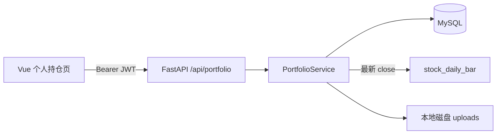

# 实现计划：个人持仓（个人服务）

**分支**: `main`（仓库默认；功能目录 `007-个人持仓`） | **日期**: 2026-03-22 | **规格**: [spec.md](./spec.md)

**输入**: 功能规格来自 `specs/007-个人持仓/spec.md`，澄清已写入「一笔交易 = 建仓至清仓、加仓/减仓为操作记录」等。

**说明**: 本计划面向**可直接实现**的粒度；表结构、接口与 [data-model.md](./data-model.md)、[contracts/personal-portfolio-api.md](./contracts/personal-portfolio-api.md) 保持一致。

## 概要

- **目标**：在「个人服务 / 个人持仓」下交付：**当前持仓**（未清仓的一笔交易）、**操作记录**（建仓/加仓/减仓/清仓）、**已完结交易**（含复盘文字与**本地上传图片**）、**参考市值/盈亏**（读现有日线收盘价）、**股票胜率**（按整笔已实现盈亏）与**操作胜率**（按操作记录自评）。
- **核心路线**：
  1. MySQL 新增 `portfolio_trade`、`portfolio_operation`、`portfolio_trade_image`（见 `data-model.md`）。
  2. 后端：`portfolio` 路由 + Service 层（加权成本、清仓结算、胜率聚合、最新收盘价查询）。
  3. 本地文件：`uploads/portfolio/{user_id}/{trade_id}/`，上传接口 + 受鉴权的文件下载。
  4. 前端：路由与菜单「个人服务」→「个人持仓」；列表/详情/表单/胜率区；**交互与视觉**按 [ui-ux.md](./ui-ux.md)（Tab/抽屉复盘/操作时间线/双胜率分区、与全站 `Layout` 一致）；能力说明用悬浮提示（符合项目前端规则）。
- **非目标**：债券/ETF、OSS、自动投资建议、与券商同步、定时任务刷新持仓。

## 技术背景

- **Language/Version**: Python 3.12 + TypeScript / Vue 3
- **Primary Dependencies**: FastAPI、SQLAlchemy、Element Plus、Vue Router、Pinia
- **Storage**: MySQL 8.x；本地文件系统（复盘图片）
- **Project Type**: Web 应用（前后端分离）

- **语言/版本**: Python 3.12（后端）、TypeScript + Vue 3（前端，与仓库一致）
- **主要依赖**: FastAPI、SQLAlchemy 2.x、MySQL、Pydantic v2；前端 Element Plus、Vue Router、Pinia、axios
- **存储**: MySQL 8.x；文件系统本地目录（复盘图片）
- **测试**: pytest（后端服务层与接口）；前端以关键交互手测 + 可选 vitest
- **目标平台**: 本地/单机浏览器 + 本机后端（规格自述场景）
- **项目类型**: Web 前后端分离
- **性能目标**: 单用户、持仓条数有限；列表接口 P95 < 500ms（本地）；无高并发要求
- **约束**: 图片大小与 MIME 白名单；`stock_code` 必须存在于 `stock_basic`
- **规模/范围**: 单用户或少量用户；全市场股票代码校验引用现有主数据

## 章程检查

- `.specify/memory/constitution.md` 为模板占位，**未核定**，**无强制门禁**。
- 项目规则：文档与注释中文；`specs/007-个人持仓/` 与实现同步维护。

## 关键设计详述

### 数据流与接口职责



1. **建仓**：前端 `POST /api/portfolio/trades/open` → 校验用户下无同股 `open` 交易 → 插入 `portfolio_trade`（`status=open`）+ 首条 `portfolio_operation`（`op_type=open`）→ 重算 `avg_cost`、`total_qty`。
2. **加仓/减仓**：`POST .../operations` → 校验 `trade` 归属与 `open` → 插入操作 → 重算加权成本与数量；`reduce` 不允许数量超过当前持仓。
3. **清仓**：`POST .../close` → 插入 `close` 操作 → `total_qty` 归零 → `status=closed`，`closed_at=now`，写入 `realized_pnl`（实现见 `research.md` 公式）。
4. **参考市值**：`GET /api/portfolio/open-trades` 时，对每个 `stock_code` 查询 `stock_daily_bar` **按 `trade_date` 降序取第一条** `close` 非空的记录；若无则 `has_ref_price=false`。
5. **复盘**：`PATCH .../review` + `POST .../images`；图片落盘路径写入 `portfolio_trade_image`。
6. **胜率**：`GET /api/portfolio/stats` 在 DB 上聚合：`closed` 交易的 `realized_pnl` 正负统计；`operation` 表 `operation_rating`  good/bad 统计（分母不含 `NULL`）。

**前端页面与接口对应**（拟）：

| 页面区块 | 主要接口 |
|----------|----------|
| 当前持仓列表 | `GET /open-trades` |
| 建仓/加仓/减仓/清仓表单 | `POST /trades/open`、`POST .../operations`、`POST .../close` |
| 已完结列表与详情 | `GET /closed-trades`、`GET /trades/{id}` |
| 复盘编辑与图片 | `PATCH .../review`、`POST .../images`、`DELETE .../images`、`GET .../file` |
| 操作自评 | `PATCH /operations/{id}/rating` |
| 胜率汇总 | `GET /stats` |
| 删除未完结持仓 | `DELETE /trades/{id}` |

**错误约定**：与契约一致；业务错误使用 `400` + `detail` 中文说明（如「同一股票已存在未完结持仓」）。

### 定时任务与部署设计

**本功能不涉及定时任务**。

- 持仓**参考市值**依赖的日线数据，由**现有**行情同步与 APScheduler（`backend/app/core/scheduler.py`）在每日流程中写入 `stock_daily_bar`；个人持仓**仅在查询时读取**最新收盘价，**不新增**调度、不新增 `sync_task` 类型。
- **部署时是否执行一次**：否。
- **手动触发**：无需为持仓单独提供；若需补日线，沿用现有 `POST /api/admin/stock-sync` 或既有脚本（见其它规格）。

### 其他关键设计

1. **鉴权**：所有 `/api/portfolio/*` 使用 `Depends(get_current_user)`（`backend/app/api/deps.py`），所有查询/写入带 `user_id` 条件。
2. **加权平均成本**（与 `research.md` 一致）：  
   - 买入类（`open`/`add`）：增加成本基数与数量；  
   - 卖出类（`reduce`/`close`）：按当前 `avg_cost` 结转成本并减少数量；  
   - 清仓时 **realized_pnl** = 累计卖出收入 − 累计卖出对应成本 − 费用（实现时与单元测试对齐一种标准公式）。
3. **操作胜率分母**：仅 `operation_rating IN ('good','bad')`；界面展示 `unrated` 数量。
4. **股票胜率**：`realized_pnl > 0` 为胜，`=0` 为持平（单独计数），`<0` 为负；与规格一致。
5. **静态文件与 URL**：图片下载接口使用 `GET /api/portfolio/images/{image_id}/file`，在接口内校验 `image.user_id == current_user.id`，**不**把绝对路径暴露给前端；可选 `nginx` 反向代理，本期非必须。
6. **路由注册**：新建 `backend/app/api/portfolio.py`，在 `main.py` 中 `app.include_router(portfolio_router, prefix="/api")`（若 router 已含 `/portfolio` 前缀则勿重复）。
7. **前端路由**：`router/index.ts` 增加 `personal-services` 子路由：父级 `Layout` 下 `children` 增加 `path: 'personal-holdings'`（或中文拼音名），`meta.title` 个人持仓；`Layout.vue` 增加 `el-sub-menu`「个人服务」+ `el-menu-item`「个人持仓」。
8. **CORS**：沿用现有全局 CORS；上传使用 `multipart/form-data`。

## 项目结构

### 本功能文档

```text
specs/007-个人持仓/
├── plan.md              # 本文件
├── research.md          # Phase 0 调研结论
├── data-model.md        # 表字段与计算定义
├── ui-ux.md             # 前端交互与视觉（高频复盘场景）
├── quickstart.md        # 本地验证步骤
├── contracts/
│   └── personal-portfolio-api.md
└── tasks.md             # 可执行任务列表（/speckit.tasks）
```

### 源码结构（拟新增/修改）

```text
backend/
├── app/
│   ├── api/
│   │   ├── portfolio.py              # 新建：路由
│   │   └── deps.py                 # 复用 get_current_user
│   ├── main.py
│   ├── models/
│   │   ├── portfolio_trade.py
│   │   ├── portfolio_operation.py
│   │   └── portfolio_trade_image.py
│   ├── schemas/
│   │   └── portfolio.py            # Pydantic 入参/出参
│   └── services/
│       ├── portfolio_service.py    # 核心业务、成本、胜率
│       └── portfolio_price_service.py  # 可选：封装 latest close 查询
├── scripts/
│   └── add_portfolio_tables.sql    # 或 Alembic 迁移
└── uploads/
    └── portfolio/                  # .gitignore 忽略内容，保留目录说明

frontend/
├── src/
│   ├── api/
│   │   └── portfolio.ts
│   ├── router/index.ts
│   ├── views/
│   │   ├── Layout.vue
│   │   └── PersonalHoldingsView.vue
│   └── ...
```

**结构说明**：与现有 `stock`、`auth` 分层一致；图片仅存本地，不引入对象存储 SDK。

## 复杂度与例外

| 项目 | 说明 |
|------|------|
| MySQL 部分唯一约束 | 「同一用户同股仅一笔 open」以应用层校验为主，避免部分索引版本差异 |
| 加权成本与券商不一致 | 规格允许用户自行折算费用；`fee` 字段参与盈亏时可配置 |

## 章程复检（Phase 1 后）

- 仍为模板章程，无新增违反项。

---

**后续命令**：建议执行 `/speckit.tasks` 生成 `tasks.md`；实现时以本计划与契约为准。
