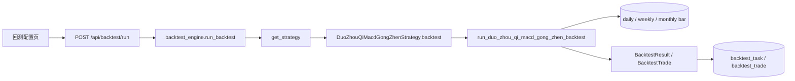

# 实现计划：多周期 MACD 共振主升浪

**分支**: `main` | **日期**: 2026-06-02 | **规格**: [spec.md](./spec.md)  
**输入**: 功能规格来自 `specs/027-多周期MACD共振主升浪/spec.md`

**说明**: 全文中文；达到可直接落地的实现粒度。首期交付 **历史回测闭环**；策略选股页与定时任务列为 Phase 2（不阻塞回测验收）。

## 概要

新增内置策略「多周期 MACD 共振主升浪」（`strategy_id=duo_zhou_qi_macd_gong_zhen`）：

- **买入**：日线在 **D6** 满足 **D0 绿 → D1…D6 红柱且 `macd_hist` 严格递增**；**日/周/月** 在 **D6** 对齐 bar 的 `macd_hist` 均 **>0**；**`close(D6) ≥ open(D1)×110%`**；以 **D6 收盘价** 买入（`trigger_date = buy_date = D6`）。
- **卖出**（自 D6 下一交易日起，**仅用收盘价**）：**−7% 止损**（仅亏损）；**MACD 红转绿 / 连续 3 日收跌**为**无条件卖出**（不论盈亏，含盈利 &lt;10%）；**+10% 武装后的 3% 移动止盈**（峰值 = 武装后最高收盘价）。

交付物：策略模块（可单测纯函数）、`registry.py` 注册、`strategy_descriptions.py` 文案、回测经 `POST /api/backtest/run` 自动分派；**不新增表**；**首期不**做选股页与 APScheduler Job。

## 技术背景

**Language/Version**: Python 3.12（后端）；本功能首期不改前端必选路径

**Primary Dependencies**: FastAPI、SQLAlchemy、现有 `StockStrategy` / `backtest_engine`（与仓库一致）

**Storage**: MySQL — `stock_daily_bar`、`stock_weekly_bar`、`stock_monthly_bar`（只读 MACD 字段）

**测试**: `pytest`；`tests/test_duo_zhou_qi_macd_gong_zhen.py` 表驱动覆盖买入窗口与 `simulate_exit`

**目标平台**: 现有后端服务 + 历史回测 UI（策略下拉来自 `/api/strategies`）

**性能目标**: 与全市场日线+周/月 MACD 批量加载策略同量级；单股内扫描 O(n)，周/月查询 O(log n)（预排序列表 + `bisect`）

**约束**: 周/月 MACD 须已回填；缺字段则跳过该候选，不 500

**规模/范围**: A 股非 ST；日线触发；周/月仅用于买入日共振判定

## 章程检查

- **当前状态**: `.specify/memory/constitution.md` 仍为模板占位，**未核定**；不视为自动门禁。
- **按项目 CLAUDE.md / 规则**：
  - 策略类须含**详细中文 docstring**（`.cursor/rules/strategy-class-documentation.mdc`）。
  - 实现若变更口径须**同步 `spec.md`**。
  - 首期无新选股页 → **暂不触发**前端悬浮能力说明；Phase 2 加页时必须补 Tooltip。
- **Phase 1 设计后复检**: 无新增违反项；未引入新中间件或存储。

## 关键设计详述

### 数据流与接口职责



1. **回测**  
   - 用户 → `POST /api/backtest/run`，`strategy_id=duo_zhou_qi_macd_gong_zhen`。  
   - `backtest_engine` 调用 `get_strategy` → `DuoZhouQiMacdGongZhenStrategy.backtest(start_date, end_date)`。  
   - 内部 `run_duo_zhou_qi_macd_gong_zhen_backtest(db, ...)`：  
     - 批量加载日线（`open, close, macd_hist`）；  
     - 批量加载周/月线（`trade_week_end` / `trade_month_end`, `macd_hist`）按 `stock_code` 分组排序；  
     - 逐股扫描：未平仓时不重复开仓；`i` 从 6 到 `len-1` 作为候选 **D6**；通过则 `buy_price=close[i]`，`trigger_date=trade_date[i]`。  
     - 调用 `simulate_exit_after_buy(...)` 生成卖单；`trade_date > end_date` 时停止监测，可能 `unclosed`。  
   - 持久化与现网一致，由引擎写入 `backtest_trade`。

2. **策略列表**  
   - `GET /api/strategies` 经 `list_strategies()` 自动包含新实例；`describe()` 提供长说明。

3. **策略执行（选股）— 首期**  
   - `execute()` 建议返回 `StrategyExecutionResult(candidates=[], message="本期仅支持历史回测")`，**不**写选股快照表。  
   - Phase 2 再复用 `detect_buy_at_index` 全市场扫描 + 前端页。

4. **错误约定**  
   - 与 `specs/010-智能回测` 一致：`STRATEGY_NOT_FOUND` 404；参数非法 4xx。  
   - 数据查询失败记录 `logger.exception`；单股逻辑错误不拖垮全任务。

### 定时任务与部署设计

**本功能首期不涉及定时任务。**

| 项 | 首期 |
|----|------|
| APScheduler Job | **不注册** |
| 部署启动执行一次 | **否** |
| 手动触发 | 仅 **回测 HTTP**（见 `contracts/strategy-api.md`） |

**Phase 2（可选）**：若产品需要日终选股，在 `backend/app/core/scheduler.py` 新增 Job，建议 **17:24（Asia/Shanghai）**（错开 17:20–17:23 批次），调用 `execute_strategy(..., strategy_id="duo_zhou_qi_macd_gong_zhen")`；失败不重试、打 error 日志，与 `ma60_five_day_break` Job 一致。

### 其他关键设计

#### 1. 模块与纯函数（可单测）

新文件：`backend/app/services/strategy/strategies/duo_zhou_qi_macd_gong_zhen.py`

| 函数 | 职责 |
|------|------|
| `_macd_hist_val(bar) -> float \| None` | 安全取 hist |
| `_is_red(h) / _is_green(h)` | 红/绿判定 |
| `six_increasing_red_ends_at(bars, i) -> bool` | D6 下标 `i`；D1=i−5；校验 D0 绿、D1…D6 红且递增 |
| `gain_filter_ok(bars, i, pct=0.10) -> bool` | `close[i] >= open[i-5]*1.10` |
| `multi_tf_macd_red(weekly_ends, monthly_ends, code, d) -> bool` | 周/月最近 bar hist>0 |
| `simulate_exit_after_buy(bars, buy_idx, buy_price, end_date, p) -> (sell_idx, sell_price, reason, extra_state)` | 四类平仓 + 优先级 |
| `run_duo_zhou_qi_macd_gong_zhen_backtest(...)` | 全市场扫描主循环 |

**`_Params`（frozen dataclass）**：

```text
gain_filter_pct = 0.10      # 买入前涨幅过滤
arm_profit_pct = 0.10       # 移动止盈武装
trailing_drawdown_pct = 0.03
stop_loss_pct = 0.07
```

#### 2. `simulate_exit_after_buy` 伪代码（须与 spec FR-007～FR-012 一致）

```text
trailing_armed = False
peak_close = None
down_streak = 0
prev_close = buy_close

for k in buy_idx+1 .. len-1:
  if trade_date[k] > end_date: break
  ck = close[k]; skip if invalid

  # ① 止损：仅亏损 7%（不要求其它条件）
  if ck <= buy_price * 0.93: return k, ck, stop_loss_7pct

  # ② 无条件卖出：MACD 红转绿（不论盈亏，含盈利<10%）
  if red(hist[k-1]) and green(hist[k]): return k, ck, sell_macd_red_to_green

  # ③ 无条件卖出：三连跌（不论盈亏）
  if ck < prev_close: down_streak++ else down_streak=0
  if down_streak >= 3: return k, ck, sell_three_down_days
  prev_close = ck

  # ④ 移动止盈（须先武装 +10%）
  if ck >= buy_price * 1.10: trailing_armed = True
  if trailing_armed:
    peak_close = max(peak_close, ck)
    if ck <= peak_close * 0.97: return k, ck, trailing_take_profit_3pct

return None  # unclosed
```

**注意**：②③**不**判断 `ck` 相对买入价盈亏；即使 `ck > buy_price` 且 `ck < buy_price*1.10` 亦须卖。① 先于 ②③④。

#### 3. 周/月数据预加载

```text
weekly_by_code: dict[str, list[tuple[date, float]]]  # 按 trade_week_end 升序
monthly_by_code: dict[str, list[tuple[date, float]]]

def latest_hist_leq(series, as_of: date) -> float | None:
    # bisect_right on ends, 取 index-1；无则 None
```

SQL 范围：`trade_week_end` / `trade_month_end` between `extended_start` and `extended_end`（与日线扩展区间对齐）。

#### 4. 单股持仓与扫描下标

- 与 `ma60_five_day_break` 相同：**平仓前不新开仓**；`sell_idx` 之后从 `sell_idx+1` 继续找下一个 `i`。  
- 仅当 `start_date <= trade_date[i] <= end_date` 时计入回测成交（买入日须在用户区间内）。

#### 5. 注册与文案

| 文件 | 改动 |
|------|------|
| `registry.py` | import + `list_strategies()` 追加 `DuoZhouQiMacdGongZhenStrategy()` |
| `strategy_descriptions.py` | 增加 `STRATEGY_DESCRIPTIONS["duo_zhou_qi_macd_gong_zhen"]` 段落 |
| `strategy_base` / 引擎 | **无** `strategy_id` 分支 |

`describe()`：`route_path=None` 或省略；`short_description` 见 `contracts/strategy-api.md`。

#### 6. 测试用例（`tests/test_duo_zhou_qi_macd_gong_zhen.py`）

| 用例 | 断言 |
|------|------|
| `test_six_increasing_red_happy` | 人造 7 根 hist 通过 |
| `test_six_increasing_fail_not_green_d0` | D0 红 → 失败 |
| `test_gain_filter_boundary` | 恰好 10% 通过 |
| `test_exit_stop_loss_before_macd` | 同日 −7% 与红转绿 → `stop_loss_7pct` |
| `test_exit_macd_red_to_green_while_profitable_under_10pct` | 盈利 +5%、未满 +10%，红转绿 → `sell_macd_red_to_green` |
| `test_exit_trailing_only_after_arm` | 未 +10% 大跌 → 不 trailing（且无红转绿/三连跌时不卖） |
| `test_exit_three_down_days` | 连续 3 阴 → 第 3 日卖 |
| `test_multi_tf_weekly_missing` | 无周线 → 不买 |

#### 7. Phase 2  backlog（本 plan 不实施）

- 前端 `DuoZhouQiMacdGongZhenView.vue` + 路由 + 悬浮说明  
- `execute()` 全市场扫描 + 选股快照  
- `scheduler.py` 17:24 Job  
- `BacktestResultDetail.vue` 增加 `exit_reason` Tooltip 映射（首期可选做）

## 项目结构

### 本功能文档

```text
specs/027-多周期MACD共振主升浪/
├── plan.md              # 本文件
├── research.md          # Phase 0
├── data-model.md        # Phase 1
├── quickstart.md        # 本地验证
├── contracts/
│   └── strategy-api.md
└── tasks.md             # /speckit.tasks 生成
```

### 源码结构（预期改动）

```text
backend/app/services/strategy/
├── registry.py
├── strategy_descriptions.py
└── strategies/
    └── duo_zhou_qi_macd_gong_zhen.py   # 新策略 + run_*_backtest

backend/tests/
└── test_duo_zhou_qi_macd_gong_zhen.py
```

**首期不改**：`scheduler.py`、`frontend/src/views/*`（除非可选 Tooltip）。

## 复杂度与例外

无需复杂度豁免；未引入新存储或新 HTTP 路由。
