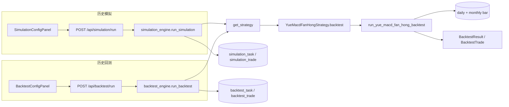

# 实现计划：月 MACD 翻红

**分支**: `main` | **日期**: 2026-06-06 | **规格**: [spec.md](./spec.md)  
**输入**: 功能规格来自 `specs/029-月MACD翻红/spec.md`

**说明**: 全文中文；达到可直接落地的实现粒度。首期交付 **历史模拟 + 历史回测** 双闭环（策略信号口径一致）；策略选股页与定时任务列为 Phase 2（不阻塞主验收）。

## 概要

新增内置策略「月 MACD 翻红」（`strategy_id=yue_macd_fan_hong`）：

- **买入**：月线 MACD **绿转红**（前一月 `macd_hist ≤ 0`、当月 `macd_hist > 0`）后的**首个红柱月 M**，于 **M 月最后一个交易日** 以**收盘价**买入（`trigger_date = buy_date = T_buy`）。
- **卖出**（自 T_buy 下一交易日起，**仅用收盘价**，**或关系**）：
  1. **止盈 +20%**：`close ≥ 买入价 × 1.20`
  2. **止损 −20%**：`close ≤ 买入价 × 0.80`
  3. **月线 MACD 红转绿**：买入月 **M 之后**任意月 **Mk** 满足前一月红柱、当月绿柱，于 **Mk 月最后一个交易日** 收盘卖出
- **同日多条件优先级**（FR-010）：**① −20% → ② +20% → ③ 月线红转绿**

交付物：策略模块（可单测纯函数）、`registry.py` 注册、`strategy_descriptions.py` 文案；历史模拟经 `POST /api/simulation/run`、历史回测经 `POST /api/backtest/run` 自动分派；**不新增表**；**首期不**做选股页与 APScheduler Job。

## 技术背景

**语言/版本**: Python 3.12（后端）；本功能首期**不改**前端必选路径（策略下拉来自 `/api/strategies` 动态列表）

**主要依赖**: FastAPI、SQLAlchemy、现有 `StockStrategy` / `simulation_engine` / `backtest_engine`

**存储**: MySQL — `stock_daily_bar`（买卖价、逐日监测）、`stock_monthly_bar`（月 MACD 信号）、`stock_basic`（主板/ST 过滤）；任务明细复用 `simulation_task` / `simulation_trade`、`backtest_task` / `backtest_trade`

**测试**: `pytest`；`tests/test_yue_macd_fan_hong.py` 表驱动覆盖买入月末判定、`simulate_exit` 三类离场与优先级

**目标平台**: 现有后端 + 智能回测 UI（历史回测 Tab）+ 历史模拟 Tab

**性能目标**: 全市场扫描；单股预加载日/月线后 O(日线条数 + 月线条数)；月线索引 `bisect` O(log n)

**约束**: 月线 `macd_hist` 须已回填；缺字段则跳过该候选，不 500；长期持仓需扩展日线加载区间至 `end_date` 之后足够远

**规模/范围**: A 股**主板**非 ST；信号稀疏、持仓可达数月～数年

## 章程检查

- **当前状态**: `.specify/memory/constitution.md` 仍为模板占位，**未核定**；不视为自动门禁。
- **按项目 CLAUDE.md / 规则**：
  - 策略类须含**详细中文 docstring**（`.cursor/rules/strategy-class-documentation.mdc`）。
  - 实现若变更口径须**同步 `spec.md`**。
  - 首期无新选股页 → **暂不触发**前端悬浮能力说明；Phase 2 加页时必须补 Tooltip。
- **Phase 1 设计后复检**: 无新增违反项；未引入新中间件或存储。

## 关键设计详述

### 数据流与接口职责



#### 1. 历史模拟（主场景）

- 用户 → **智能回测 → 历史模拟** → `SimulationConfigPanel` 选择 `yue_macd_fan_hong` → `POST /api/simulation/run`。
- 请求体（与现网一致）：

```json
{
  "strategy_id": "yue_macd_fan_hong",
  "start_date": "2020-01-01",
  "end_date": "2024-12-31"
}
```

- `simulation_engine.run_simulation` 调用 `strategy.backtest(start_date, end_date)`，**不做** `portfolio_simulation`；全部 `closed` / `unclosed` 写入 `simulation_trade`。
- 响应：任务 `task_id`；轮询 `GET /api/simulation/tasks/{task_id}` 获取 `trades[]`、`assumptions`、`strategy_description`。

#### 2. 历史回测

- 用户 → **智能回测 → 历史回测** → `BacktestConfigPanel` 选择本策略 → `POST /api/backtest/run`（含 `position_amount`、`reserve_amount`）。
- `backtest_engine` 同样调用 `strategy.backtest()`，再经 `simulate_single_slot_portfolio` 可能产生 `not_traded`；**策略层信号与模拟一致**。

#### 3. 策略列表（自动增量）

- `GET /api/strategies` 经 `list_strategies()` 包含新实例；回测与模拟下拉**无需改前端**。

#### 4. 策略执行（选股）— 首期

- `execute()` 返回 `StrategyExecutionResult(candidates=[], message="本期仅支持历史模拟/回测")`，**不**写选股快照表。

#### 5. 错误约定

- 与 `specs/010-智能回测` 一致：`STRATEGY_NOT_FOUND` → 404；日期非法 → 400。
- 单股数据缺失 → `skipped_count++`，不拖垮全任务。

### 定时任务与部署设计

**本功能首期不涉及定时任务。**

| 项 | 首期 |
|----|------|
| APScheduler Job | **不注册** |
| 部署启动执行一次 | **否** |
| 手动触发 | **历史模拟** `POST /api/simulation/run`；**历史回测** `POST /api/backtest/run`（Bearer Token 鉴权，与现网一致） |

**Phase 2（可选）**：若产品需要日终「月线刚翻红」选股，在 `backend/app/core/scheduler.py` 新增 Job，建议 **17:25（Asia/Shanghai）**（错开 17:20–17:24 批次），调用 `execute_strategy(..., strategy_id="yue_macd_fan_hong")`；失败不重试、打 error 日志。

### 其他关键设计

#### 1. 模块与纯函数（可单测）

新文件：`backend/app/services/strategy/strategies/yue_macd_fan_hong.py`

| 函数 | 职责 |
|------|------|
| `_hist_val` / `_is_red` / `_is_green` | 复用 `duo_zhou_qi_macd_gong_zhen` 或本地等价 |
| `monthly_green_to_red_pairs(monthly_series) -> list[tuple[int,int]]` | 返回相邻月线下标 `(i-1, i)`，满足绿→红 |
| `build_month_last_trade_dates(daily_bars, monthly_series) -> dict[date, date]` | `trade_month_end → 该月最后交易日` |
| `detect_buy_signals(...)` | 对每个绿转红月 M，取 `T_buy = month_last_trade[M]`，校验有效收盘、区间、主板 |
| `is_last_trading_day_of_month(daily_bars, k) -> bool` | 判断下标 `k` 是否为当月最后交易日 |
| `monthly_red_to_green_at(monthly_series, month_end) -> bool` | 给定月 `month_end`，前一月红、当月绿 |
| `simulate_exit_after_buy(...)` | ±20% 逐日 + 月末 MACD 红转绿 |
| `run_yue_macd_fan_hong_backtest(...)` | 全市场扫描主循环 |

**`_Params`（frozen dataclass）**：

```text
take_profit_pct = 0.20
stop_loss_pct = 0.20
```

#### 2. 买入扫描算法

```text
对每个 stock_code:
  加载 daily_bars（extended 区间）、monthly_series（按 trade_month_end 升序）
  构建 month_last_trade: dict[trade_month_end, last_trade_date]
  last_block = -1

  for 每个绿转红对 (prev_i, curr_i):
    M_end = monthly_series[curr_i].trade_month_end
    T_buy = month_last_trade.get(M_end)
    if T_buy 无效或不在 [start_date, end_date]: continue
    buy_idx = daily 下标 of T_buy
    if buy_idx <= last_block: continue（未平仓不重复开）
    buy_price = close[buy_idx]

    sell_idx, sell_px, exit_reason = simulate_exit_after_buy(...)

    若 unclosed: append unclosed; last_block = len-1; break 内层
    否则 append closed; last_block = sell_idx
```

**绿转红判定**（与 spec FR-004 一致）：

```text
hist(prev) <= 0 且 hist(curr) > 0
prev、curr 的 macd_hist 均须有效（非 None）
```

**月末最后交易日**（与 spec 假设一致）：

```text
对 daily bar 日期 D，对齐月 M_end = max{ trade_month_end | trade_month_end <= D }
month_last_trade[M_end] = max D（遍历所有 daily）
```

#### 3. `simulate_exit_after_buy` 伪代码

```text
buy_month_end = 对齐于 buy_date 的 trade_month_end

for k in buy_idx+1 .. len(daily)-1:
  if trade_date[k] > end_date: break
  ck = close[k]; 无效则 continue

  # ① 止损 −20%
  if ck <= buy_price * 0.80:
    return k, ck, stop_loss_20pct

  # ② 止盈 +20%
  if ck >= buy_price * 1.20:
    return k, ck, take_profit_20pct

  # ③ 月线 MACD 红转绿（仅在该月最后交易日判定）
  if is_last_trading_day_of_month(daily, k):
    curr_month_end = 对齐月(trade_date[k])
    if curr_month_end > buy_month_end:
      if monthly_red_to_green_at(monthly_series, curr_month_end):
        return k, ck, sell_monthly_macd_red_to_green

return None  # unclosed
```

**注意**：

- ③ 仅在 **买入月 M 之后** 的月份月末判定（`curr_month_end > buy_month_end`）。
- ①② 每个交易日均判定；③ 与 ①② 同日成立时按 FR-010 优先级（已在 ①② 先判）。

#### 4. 数据预热与区间扩展

| 变量 | 建议值 | 理由 |
|------|--------|------|
| `extended_start` | `start_date − 120 日历日` | 覆盖买入前至少 2 根月线 + 月末对齐 |
| `extended_end` | `end_date + 1500 日历日`（约 4 年） | 长期持仓可能跨数年才触发 ±20% 或月线红转绿 |

卖出仿真在 `trade_date > end_date` 时停止 → 可能 `unclosed`（与现网引擎一致）。

#### 5. 单股持仓与扫描

- 与 `lian_xu_da_ban` 相同：**平仓前不新开仓**；`last_block = sell_idx` 后继续找下一绿转红对。
- 仅当 `start_date ≤ T_buy ≤ end_date` 时计入用户区间内的买入。

#### 6. 注册与文案

| 文件 | 改动 |
|------|------|
| `registry.py` | import + `list_strategies()` 追加 `YueMacdFanHongStrategy()` |
| `strategy_descriptions.py` | 增加 `STRATEGY_DESCRIPTIONS["yue_macd_fan_hong"]` |
| `strategy_base` / 引擎 | **无** `strategy_id` 硬编码分支 |

`describe()`：`route_path="/backtest/simulation"`（主场景入口）；`short_description` 见 `contracts/strategy-api.md`。

#### 7. 测试用例（`tests/test_yue_macd_fan_hong.py`）

| 用例 | 断言 |
|------|------|
| `test_monthly_green_to_red_detect` | 人造两月 hist 绿→红 → 产生买入月 |
| `test_buy_on_month_last_trade_day` | T_buy 为该月最后交易日，非月初 |
| `test_no_buy_missing_prev_month` | 仅一月数据 → 不买 |
| `test_exit_take_profit_20` | +20% 触发 `take_profit_20pct` |
| `test_exit_stop_loss_20` | −20% 触发 `stop_loss_20pct` |
| `test_exit_monthly_red_to_green` | M+2 月末红转绿 → `sell_monthly_macd_red_to_green` |
| `test_exit_priority_loss_before_profit` | 同日 −20% 与 +20% 不可能；同日 −20% 与红转绿 → `stop_loss_20pct` |
| `test_no_macd_sell_in_buy_month` | 买入月内月末不触发 ③ |
| `test_simulation_backtest_same_signals` | 同一 `run_*_backtest` 输出一致（策略层） |

#### 8. Phase 2 backlog（本 plan 不实施）

- 前端 `YueMacdFanHongView.vue` + 路由 + 悬浮说明
- `execute()` 输出「截止日所在月刚翻红 / 前一月绿当月红」候选
- `scheduler.py` 17:25 Job
- `BacktestResultDetail.vue` / 模拟详情 `exit_reason` Tooltip 映射（首期可选做）

## 项目结构

### 本功能文档

```text
specs/029-月MACD翻红/
├── plan.md              # 本文件
├── research.md          # Phase 0
├── data-model.md        # Phase 1
├── quickstart.md        # 本地验证
├── contracts/
│   └── strategy-api.md
└── tasks.md             # /speckit.tasks 生成
```

### 源码结构（预期改动）

```text
backend/app/services/strategy/
├── registry.py
├── strategy_descriptions.py
└── strategies/
    └── yue_macd_fan_hong.py   # 新策略 + run_*_backtest

backend/tests/
└── test_yue_macd_fan_hong.py
```

**首期不改**：`scheduler.py`、前端 Vue 页面（策略下拉自动生效）；可选补充详情页 `exit_reason` 文案。

## 复杂度与例外

无需复杂度豁免；未引入新存储或新 HTTP 路由。
